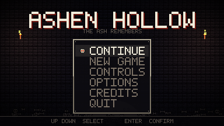
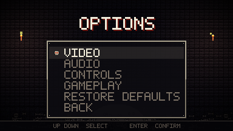
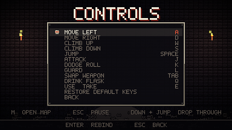
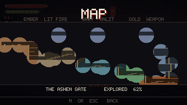
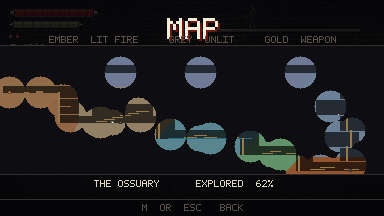
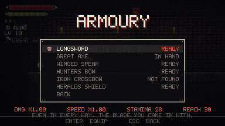
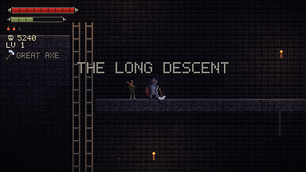
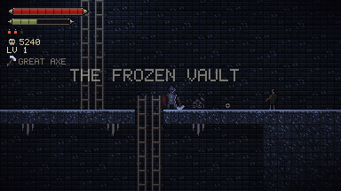
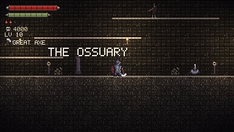

# Ashen Hollow

A 2D souls-like in dark retro pixel art. **Engine: Godot 4.3+.**

Every pixel and every sound in this project is **generated from code** — there is
no downloaded art, no licensed audio, no asset store. `tools/gen_art.py` draws
the sprites, `tools/gen_audio.py` synthesises the soundtrack, and
`tools/gen_level.py` carves the dungeon and then *proves* you can walk it.

Current state: **a complete, playable game.** Eight themed regions across sixteen
screens with ladders, ledges and one-way beams; bonfires as checkpoints, a flask,
souls you drop where you fall; six weapons that play nothing like each other;
levelling and respec; a map with fog of war; fast travel; a full settings screen
with rebindable keys and gamepad support; saving; and a soundtrack.



## Running it

1. Install Godot 4.3 or newer: <https://godotengine.org/download>
2. Open Godot → **Import** → pick this `project.godot`.
3. The first open imports the PNGs and WAVs automatically. Then **F5**.

## Controls

Every action below is **rebindable** in OPTIONS → CONTROLS, and every one of them
also has a gamepad binding out of the box.

| Key | Action |
|---|---|
| `A` / `D` (or ←/→) | Move |
| `Space` | Jump |
| `J` or left mouse | Attack |
| `K` or `Shift` | **Dodge roll** |
| `L` or right mouse | **Guard** (shield only) |
| `Tab` or `R` | **Swap weapon** (cycles what you have found) |
| `Q` | **Drink flask** (heals, and leaves you defenceless for a beat) |
| `E` | **Bonfire**: light, rest, level up, travel — and **pick weapons up** |
| `W` `S` (or ↑/↓) | **Climb** a ladder |
| `S` + `Space` | **Drop through** a wooden beam |
| `M` | **Map** |
| `Esc` | Pause |
| `↑ ↓` / `W` `S`, `Enter` | In menus: select, confirm |

The jump is deliberately forgiving, because the most common complaint about this
whole genre is that its platforming is not:

- **Coyote time** (0.10 s): you can still jump just after walking off a ledge.
- **Jump buffering** (0.12 s): a jump pressed slightly early fires on landing.
- **Variable height**: hold for the full arc, tap for a hop.

None of the three extend the jump while the button is held, so the reachability
proof below still describes exactly what the level demands.

## Menus and HUD

- **Title screen**: a crypt lit by two guttering torches with a skull rising out
  of the bone heap. **CONTINUE** appears only when there is a run to continue,
  and **NEW GAME** asks before erasing one.
- **Bone HUD**: health over stamina in carved bone troughs, flask charges as
  pips, souls beside a skull, level, and the weapon in your hands. Health carries
  a **ghost bar** — a paler smear that lags a beat behind after a hit, so you can
  see what that mistake cost.
- **Pause menu** (`Esc`): resume, map, progress, controls, options, quit.
- **Bonfire menu** (`E` at a fire): rest, level up, armoury, travel.
- **Options**, one widget shared by the title and pause screens:
  - **VIDEO** — window scale or fullscreen, vsync, frame rate cap, vignette,
    screen shake
  - **AUDIO** — master, music, sound and ambience, independently
  - **CONTROLS** — every action rebindable, with conflict detection (a key that
    is already doing something else is refused, and told why) and restore
    defaults
  - **GAMEPLAY** — HUD hints, region banners, auto-equip
- **Pixel font**: the UI is drawn with a 5×7 bitmap font generated alongside the
  art. Godot's default font would wreck the look at 384×216.




## How the world is drawn

Eight regions that differ only in colour still look like one corridor repainted
eight times. What makes them places is **depth**, and that comes from four
things, not from more texture:

- **Three layers.** The back wall gets its own canvas item (`BACK_Z`), the props
  sit in front of it (`DECO_Z`), the stone in front of them (`TERRAIN_Z`). That
  is why a chain disappears into the ceiling it hangs from instead of being
  painted over it.
- **The back wall is dimmed** (`BACK_DIM`). Before that, solid rock and empty air
  were drawn at the same brightness and the whole screen read as one field of
  noise. This one number buys more readability than any texture.
- **The ground is crusted.** Every stone tile with air above it is drawn from
  `tile_cap_*`: ash, bone chips, wet algae, roots, embers, frost. That lit lip is
  what turns a tiled texture back into a floor you could stand on.
- **Contact shadow and depth falloff.** Open tiles touching stone are darkened,
  most under an overhang, and rock gets darker the deeper it sits. Without it the
  mass under a ledge is one flat slab the height of the screen.

And what breaks the repetition:

- **Four variants** of every tile, picked per position by a hash, plus a little
  brightness jitter. One tile 24 times across a screen reads as wallpaper.
- **Prop silhouettes** (`deco.png`): chains, pillars, bone piles, roots, icicles,
  banners, skulls on spikes, arches. One sheet, tinted per region. They are hung
  off the geometry — `L.hang` and `L.stand` in `gen_level.py` find the ceiling or
  floor themselves — rather than at hand-typed pixel heights.
- **One particle field per region**, following the camera and re-dressed at every
  border: falling ash at the gate, drips in the shaft, bubbles in the cistern,
  spores in the rootworks, embers in the forge, snow in the vault, wind on the
  ramparts. Still air reads as a diagram; moving air reads as a place.
- **The camera looks up** 16px. Centred on the knight, a third of every frame was
  the rock under his feet.

Small things in the same spirit: an impact squash and kicked-up grit on landing
(the sprite is anchored at the feet, so the squash presses him into the floor
rather than lifting him off it), a blown-out white frame on a hollow that takes a
hit, and a lit water line only along the top of the pool rather than a stripe per
tile.

## The world

Sixteen screens wide and eight tall (384×128 tiles), laid out as **one
continuous route**: west to east and steadily down, then back up the east side
and west again along the ramparts, which returns you above where you started.

| Region | What it is |
|---|---|
| THE ASHEN GATE | Where you come in. The first fire. |
| THE LONG DESCENT | A shaft down to the bones, ladders and ledges. |
| THE OSSUARY | A tall gallery of beams over rows of the dead. |
| THE FLOODED CISTERN | Standing water you wade through. |
| THE ROOTWORKS | Fungus-lit, and the only thing down here still growing. |
| THE EMBER FORGE | Braziers that were never banked. |
| THE FROZEN VAULT | The cold keeps them. That is all it is for. |
| THE RAMPARTS | High above everything, running back west. |

Each region has its own stone palette *and* its own torch colour. Cold blue stone
under warm orange light otherwise reads as the room you just left. The palettes
live in `THEMES` (`gen_art.py`), the light colours in `THEME_LIGHT`
(`gen_level.py`) — art and level data kept apart.

Entering a region announces its name. **Twenty-four inscriptions** lie along the
route; step on one and it lights up and shows its line. That is the whole story:
no cutscenes, no NPCs.

There is **one** voice: the last keeper, who stayed behind to tend the fires and
kept carving further in. The stones read in the order you physically reach them,
and because the route loops back west along the ramparts, the last one you find
is the only one that is about you:

> THE GATE AHEAD OPENS FROM THE OTHER SIDE. NOTHING HERE DOES.
>
> YOU CAME IN THROUGH THAT GATE. SO DID I.

### Why the level is generated

`tools/gen_level.py` **carves** the dungeon out of solid rock: the grid starts
full, rooms and shafts are cut out of it, and then ledges, ladders, beams and
water are placed. It writes `scripts/LevelMap.gd`.

The point is not procedural variety — the layout is deterministic. The point is
the **proof**. Before writing anything, the generator runs a breadth-first search
across every standing tile using the knight's *real* jump envelope (apex 40.5px,
derived from `GRAVITY` and `JUMP_VELOCITY` in `Player.gd`) and checks that every
enemy, bonfire, inscription and weapon can actually be reached from the spawn. If
one cannot, it prints the offender and exits non-zero.

That check has caught sixteen-plus layout errors that would have been invisible
at this scale: four whole beam chains sitting three rows above their floor —
unjumpable — and a dozen entities floating over shafts with no ground under them.

It also decides, per tile, **which stone that tile is cut from** (nearest region),
which is what removed a hard seam of the wrong colour running under half the map,
and marks rock that no opening comes near as never-drawn.

## Visible progress

Souls you only collect are a score. Everything hangs off them instead:

- **Levelling at a bonfire** (`E` → LEVEL UP). Five stats, each with its effect
  written next to it so nothing has to be guessed:

  | Stat | Effect |
  |---|---|
  | VIGOR | Health (+12 per point) |
  | ENDURANCE | Stamina (+10) |
  | AGILITY | Move speed (+4) |
  | STRENGTH | Damage (+5) |
  | FINESSE | Attack speed (−0.011 s per swing) |

  The price climbs with total level, so a farmed bonfire cannot trivialise the
  run.
- **RESPEC**, free and unlimited, on the same page. Six weapons that each want
  different stats are worth nothing if the first ten points you spend quietly
  lock you out of five of them.
- **The bars physically grow.** VIGOR and ENDURANCE stretch their HUD bar visibly
  to the right — which is why the frames are NinePatch: the fang caps stay crisp
  while the plate between them grows. A number going up in a menu is bookkeeping;
  a bar that reaches further across the screen is progress you can see.
- **Bonfires start cold.** An unlit fire reads as a dead heap from across a room;
  `E` lights it with a flare of light, and it stays lit for the rest of the run.
- **Weapons lie in the world.** Five of the six are found only by going somewhere
  you have not been.
- **Progress page** (`Esc` → PROGRESS): all five stats, level, weapons found,
  bonfires lit, regions found, inscriptions read, hollows slain and **deaths** —
  each as `x / y`. The deaths are there on purpose: a souls game that hides that
  number is being coy about the only figure that describes the run.



## The map

Sixteen screens of keep with no way to see where you are is the complaint this
genre keeps getting, and it is a fair one. `M` opens it from anywhere.

At 384×128 tiles the map is exactly **one pixel per tile**, so the whole thing
fits the screen at 1:1 with nothing scaled or scrolled — which is the only reason
a map this cheap is also readable. Fog of war fills in behind you as you walk,
each region is drawn in its own light colour, ladders and beams pick out how you
get around, and lit fires, unlit fires and weapons you have not taken are marked.



## Weapons

Six of them, and each one is a real **trade** rather than a straight upgrade —
otherwise finding one just retires the last one and the choice evaporates. Damage
and speed are multipliers on the stats bought at a bonfire, so a levelled
STRENGTH or FINESSE keeps counting whatever you are holding.

| Weapon | Damage | Speed | Stamina | Reach | What it is for |
|---|---|---|---|---|---|
| **LONGSWORD** | ×1.00 | ×1.00 | 28 | 30 px | The baseline. Nothing about it is best; nothing about it is bad. |
| **GREAT AXE** | ×1.90 | ×1.60 | 42 | 27 px | Nearly double the damage, slow enough to get you killed, throws hollows out of their own range. |
| **WINGED SPEAR** | ×0.80 | ×0.92 | 24 | **46 px** | Hits from outside their swing. A narrow thrust — aim it. |
| **HUNTERS BOW** | ×0.62 | ×1.25 | 20 | ranged | Arrows at 300 px/s that **drop**. Thins them out before they arrive. |
| **IRON CROSSBOW** | ×1.55 | ×2.10 | 32 | ranged | One flat, heavy bolt at 470 px/s. Then a reload you will feel. |
| **HERALDS SHIELD** | ×0.45 | ×1.05 | 16 | 22 px | Absorbs **80%** of a hit for stamina. Run out and the **guard breaks**. |

- **Every weapon has its own idle, run and attack frames** (`hero_idle_*.png`,
  `hero_run_*.png`, `hero_attack_*.png`). The knight visibly carries what he
  found, standing still as well as mid-swing. All six are drawn procedurally from
  the same hand so the poses match.
- **Guarding** works only with the shield and only against blows from the front.
  Your back stays open, and a hit on an empty stamina bar breaks the guard.
- **The armoury** at a bonfire lists all six, including the ones you have not
  found: five blank rows would say "there is nothing out there", five named ones
  say "there are five more places to go". Each row prints its actual numbers,
  not just prose.
- **Where they are**: axe in the ossuary, spear in the cistern, shield in the
  rootworks, crossbow in the frozen vault, bow on the ramparts. The reachability
  check proves you can get to each one.



## The loop

- **Bonfires are checkpoints.** `E` to rest heals, refills the flask and brings
  **every** hollow back. Rest here and you respawn here — across sixteen screens
  that is not a convenience, it is the condition under which dying is a challenge
  rather than a punishment.
- **Fast travel** between any two lit fires, from the bonfire menu. A fire you
  have already lit is a place you have already earned.
- **The flask** (3 charges) heals 45 but locks you in place for 0.75 s and grants
  **no** i-frames. Drinking in front of a winding-up hollow should be the wrong
  call, not a free reset.
- **Souls drop on death**, as a glowing orb where you fell. Touch it to get them
  back. Die again first and the old pile is gone for good.
- **Saving** happens at the two moments that matter: resting at a fire, and
  dying. A save is therefore always at a checkpoint and never mid-fall.
- **Hit feedback**: sparks at the point of contact and a short camera kick, which
  rounds to whole pixels — a fractional camera offset makes the whole scene
  shimmer instead of shake. Switchable off in options.

## Combat

The souls logic: **every action costs stamina and commits you** — attacks and
rolls cannot be cancelled. Swing blindly and you will be standing there empty
when the hollow does not.

- **Stamina** (100): an attack costs what the weapon asks (16–42), a roll 22.
  Regeneration 38/s, starting 0.45 s after the last action. Without enough
  stamina the action does not start at all.
- **Dodge roll**: 0.42 s long, **i-frames from 0.07 s to 0.30 s** — roughly the
  middle 55%. The knight tints cyan during the window so it can be read.
- **Attack**: 0.36 s with the longsword, landing at 42% of the swing. The weapon
  and FINESSE stretch or compress that; the animation plays back proportionally
  faster, or the blow would land after it finished.
- **The hollow winds up visibly for 0.55 s** before it strikes — long enough to
  time the roll — then recovers for 0.55 s: that is your window.
- **Hits** grant 0.65 s of invulnerability plus knockback.
- **Souls**: 60 per hollow, dropped where you fall (see above).

Hit detection deliberately runs on **explicit rectangle tests** in code
(`Player._swing()`, `Hollow._strike()`) rather than physics layers —
deterministic, easy to follow, and with no invisible configuration.

## Sound

There is no sampled or licensed audio in this project either. `tools/gen_audio.py`
synthesises **24 sound effects, 5 ambience loops and 2 music loops** from
oscillators and filtered noise, using nothing but the Python standard library:

```bash
python3 tools/gen_audio.py
```

The palette is narrow on purpose — low sine and triangle bodies for weight,
filtered noise for steel, cloth and stone, and a single scale (D natural minor)
for anything tonal, so the menu chimes, the bonfire and the music are all in the
same key.

Each weapon has its own swing, built from its own weight: the axe is heavier and
slower than the sword because its envelope *is* heavier and slower. Regions
crossfade their ambience — stone, deep, water, forge, wind — so walking from the
cistern into the rootworks does not sound like someone changed the record.

Playback runs on three buses (SFX, MUSIC, AMBIENCE) through a twelve-voice pool,
each with its own volume in the options.

## Testing (no window needed)

The whole game can be played through **headless**, which is how you check that a
change did not break anything without opening Godot:

```bash
tools/run_tests.sh                      # Godot from PATH
GODOT=/path/to/godot tools/run_tests.sh # or explicitly
```

The runner checks the **level layout** first (reachability, above) and then plays
**two suites**, together **187 assertions**:

- `tools/smoke_test.gd` (123) boots the real `Main.tscn` and drives it a physics
  frame at a time: landing and movement, the stamina economy (including: an
  attack with no stamina never starts), hit detection, roll i-frames and the
  vulnerable recovery, the hollow's full telegraph cycle, climbing and dropping
  through, flask and bonfire, souls and dropping them on death, the HUD, death
  and respawn at the checkpoint, levelling, and every weapon — that the axe hits
  harder and slower, that the spear reaches further and hits softer, that the bow
  puts a real arrow in the world that damages what it hits, that the shield
  absorbs a blow and breaks when the stamina runs out.
- `tools/menu_test.gd` (64) walks a player's path: navigating, opening CONTROLS
  and OPTIONS, changing a video setting and checking it reached the engine,
  lowering a volume, rebinding a key and checking the **InputMap** actually moved
  with it, having a duplicate key refused, restoring defaults, starting the game,
  pausing, and quitting back to the title.

The level check is a separate stage on purpose: a ledge nobody can jump to lets
**both** engine suites run happily green.

Four traps the runner catches deliberately:

- **Godot exits 0 even when a script hits a runtime error.** Every `SCRIPT ERROR`
  line therefore counts as a failure — that is how parse errors in the menus once
  slipped through while both suites reported PASS.
- **A suite that never starts** would print nothing and exit 0. The runner
  requires the suite's own banner in the output.
- **Headless draws nothing.** Anything you can only *see* is checked through
  invariants instead: that the bar fill sits *after* its bone frame in child
  order, for instance — the frame is opaque across the channel and would
  otherwise paint over it completely.
- **A missing glyph draws a space, silently.** `PixelLabel` records every
  character it could not draw, and both suites assert that record is empty at the
  end — which covers strings assembled at runtime, like `EXPLORED 61%`, that no
  list of literals in a test could ever cover.

## Building a release

```bash
tools/build.sh                       # all three desktop platforms
tools/build.sh Linux                 # or just one
GODOT=/path/to/godot tools/build.sh
```

The script regenerates **every asset from its generator**, runs the full test
suite, and only then exports. That order is the point: the art, the audio and the
level are outputs of scripts in this repository, so a build must never ship a PNG
that no longer matches the code that draws it.

Presets for **Windows, Linux and macOS** are versioned in `export_presets.cfg`,
output goes to `build/`. Building needs Godot's **export templates** for the
matching version installed (Editor → Manage Export Templates, or drop the `.tpz`
contents in `~/.local/share/godot/export_templates/`); the script says so plainly
if they are missing.

Two platform notes, both discovered by actually running the exports:

- The Windows preset embeds the icon and version info through **rcedit**, which
  is a separate tool Godot calls out to. Without it the export still succeeds and
  only warns; the executable just carries the default icon.
- The macOS universal build requires **ETC2 ASTC** VRAM compression to be enabled
  in project settings, even though nothing here is VRAM compressed — every
  texture is lossless pixel art with nearest filtering. It is enabled for that
  reason alone.

## Screenshots

For an actual look at the thing there is a screenshot run (it needs a display, so
Xvfb in CI):

```bash
xvfb-run -a godot --path . --script res://tools/screenshot.gd
```

It writes `tools/shots/*.png`: title, controls, HUD, pause, map, armoury,
progress, every settings page, and one shot from each region.





## Project layout

```
ashen-hollow/
├─ project.godot          Pixel-perfect config (nearest filter, 384x216 viewport)
├─ scenes/
│   ├─ MainMenu.tscn      Start scene (title screen)
│   └─ Main.tscn          The game
├─ scripts/
│   ├─ Main.gd            Assembles level, light, HUD and cast from the map
│   ├─ Level.gd           Draws the terrain, builds collision, answers tile queries
│   ├─ LevelMap.gd        GENERATED by gen_level.py: grid, collision rects,
│   │                     entities, region rects, per-tile stone — do not hand-edit
│   ├─ MainMenu.gd        Title screen: torches, embers, menu, continue/new game
│   ├─ PauseMenu.gd       Esc menu; runs on while the tree is paused
│   ├─ OptionsMenu.gd     The settings screen, shared by both menus
│   ├─ MapView.gd         The keep at one pixel per tile
│   ├─ MenuList.gd        Menu entries with a skull cursor
│   ├─ PixelLabel.gd      Draws text with the bitmap font
│   ├─ UiTheme.gd         Palette, menu layout, panel and bar geometry
│   ├─ Settings.gd        Options, saved to user://settings.cfg
│   ├─ Keys.gd            The control scheme: defaults, rebinding, gamepad
│   ├─ Audio.gd           Buses, voice pool, music and ambience crossfades
│   ├─ Run.gd             Progress: stats, checkpoint, souls, map, save file
│   ├─ BonfireMenu.gd     Rest, level up, armoury and travel at a fire
│   ├─ Weapons.gd         The weapon table: damage, speed, reach, block
│   ├─ Projectile.gd      Arrows and bolts in flight
│   ├─ Player.gd          State machine, stamina, i-frames, attacks, guard
│   ├─ Hollow.gd          Enemy AI: chase → wind up → strike → recover
│   ├─ HUD.gd             Bone bars, damage ghost, souls, weapon, YOU DIED
│   └─ SpriteUtil.gd      Slices sprite sheets into animations
├─ assets/ui/
│   ├─ font_5x7.png       Bitmap font (49 characters, white → tinted in game)
│   ├─ skull.png          Cursor skull, 2 frames [dim, ember-eyed]
│   ├─ bar_frame_hp/sp.png  Bone troughs for health and stamina
│   └─ menu_bg.png        Crypt backdrop with a bone heap (384x216)
├─ assets/sprites/
│   ├─ hero_idle_*.png    44x32, 4 frames    ┐ one set PER WEAPON (sword, axe,
│   ├─ hero_run_*.png     44x32, 6 frames    │ spear, bow, crossbow, shield),
│   ├─ hero_attack_*.png  44x32, 4 frames    │ all anchored on the feet
│   ├─ hero_block.png     44x32, 2 frames    │ (frame pixel 22,31) → Godot
│   ├─ hero_roll.png      44x32, 4 frames    │ offset (-22,-31)
│   ├─ hollow.png         44x32, 6 frames    ┘ [idle,idle,windup,strike,hurt,dead]
│   ├─ tile_floor/wall/cap_<region>.png      4 variants each, per region
│   ├─ deco.png           16x32, 8 props tinted per region
│   ├─ weapon_icons.png   14x14, 6 icons for the floor and the HUD
│   ├─ arrow.png, bolt.png
│   └─ bonfire.png, torch.png, light_soft.png, rune.png, soul_orb.png
├─ assets/audio/          31 WAVs, all synthesised by gen_audio.py
└─ tools/
    ├─ gen_art.py         >>> The pixel art generator (source of every sprite) <<<
    ├─ gen_level.py       >>> The level generator (+ reachability proof) <<<
    ├─ gen_audio.py       >>> The sound generator (source of every sound) <<<
    ├─ smoke_test.gd      Headless combat suite
    ├─ menu_test.gd       Headless menu and options suite
    ├─ screenshot.gd      Real in-engine screenshots
    └─ run_tests.sh       Level check + both suites, as a CI gate
```

## The pixel art pipeline

Every sprite is **produced from code** (Python + Pillow) so the art stays
reproducible and reviewable in version control:

```bash
python3 tools/gen_art.py
```

Sprites are defined as text grids (one character = one palette colour); the
palette is at the top under `PAL`, the knight under `PLAYER`, the enemy under
`HOLLOW`. The run cycle and every weapon are procedural — a sine-driven stride,
and blades, hafts, bows and shields drawn out of the knight's hand so that idle,
run and attack all carry the same piece of steel.

The **interface** is made the same way: `GLYPHS` holds the font, `SKULL` and
`BONE_LONG` the bone pieces, `big_skull()` draws the large skull with real
geometry (an upscaled 11px icon is just mush), and `menu_backdrop()` assembles
stonework, skull, bone heap and vignette.

The menu layout (`TITLE_Y`, `MENU_Y0`, `SKULL_TOP`) lives in `gen_art.py` **and**
in `UiTheme.gd` — the backdrop bakes the skull relative to those values and the
engine places the text against them. Change one and you must change the other.

## What is not here yet

1. **More enemy types**, and a first boss with several attack patterns.
2. **Shortcuts and branches** in the level: doors that open from one side only,
   to match the inscription at the sealed gate.
3. **Localisation.** All text is English and lives in code; there is no string
   table yet.
4. **Steam integration** (achievements, cloud saves) — the game runs standalone
   and saves locally, so shipping means uploading the `build/` output; the
   Steamworks SDK is not wired in.
